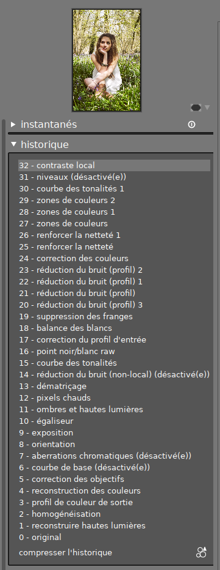
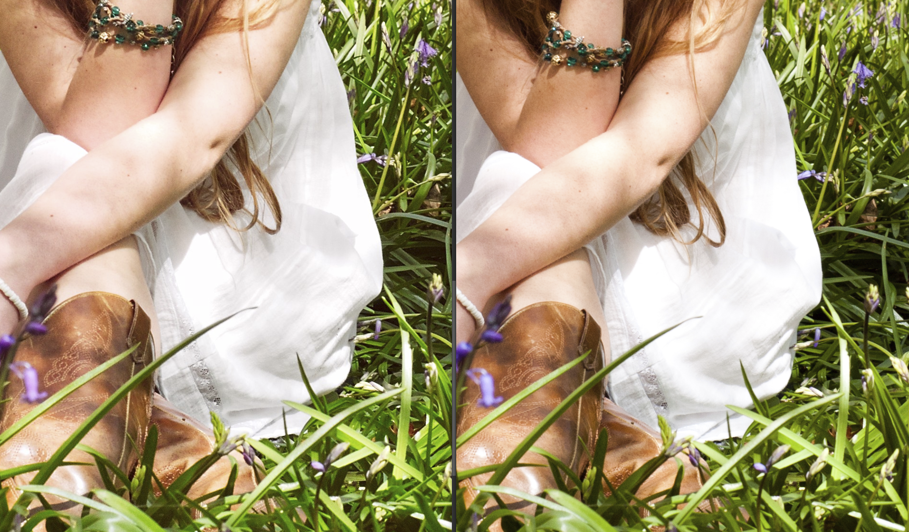
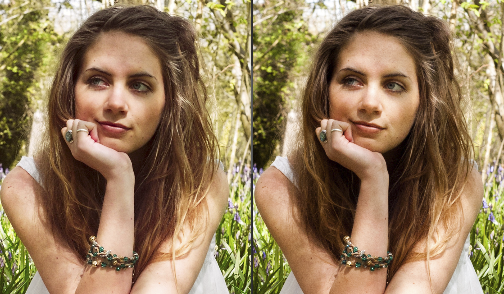
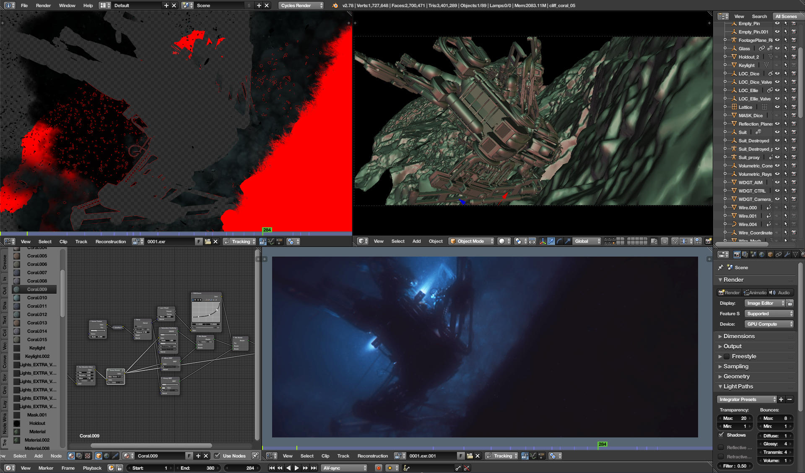
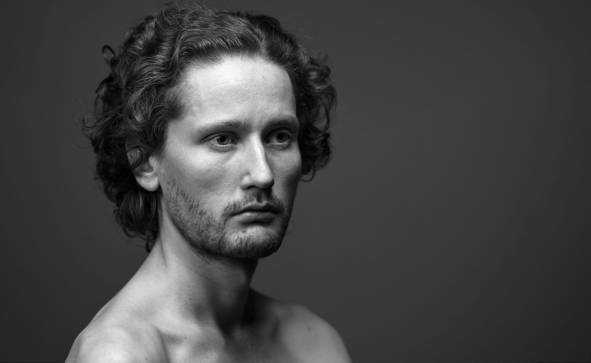

Depuis la sortie de darktable sous Windows, en décembre 2017, les articles de test et de comparaison se sont multipliés dans la presse photo et sur divers blogs. Sur darktable.fr, on ne s'en réjouit pas tellement. Pourquoi ? Les erreurs, voire les idioties, qu'ils contribuent à colporter ne servent pas la communauté, bien au contraire.

J'avais déjà passé la [première couche](https://darktable.fr/forum/showthread.php?tid=2044), justement en décembre 2017, il est plus que temps pour la deuxième.

## darktable, le Lightroom gratuit

Dans la tête des journalistes photo, Lightroom est un tel _must_ que tout logiciel de traitement de photos brutes ne peut être qu'une tentative de copie. Qu'on souhaite faire quelque chose d'autre qu'un clone n'est pas une possibilité. Un peu comme les psychanalystes, pour qui tout lapsus ne peut être qu'une manifestation d'un inconscient enfoui et refoulé, jamais un hasard linguistique (il faut trouver du sens partout). Donc, fatalement, dans tous les tests, darktable est un Lightroom en moins bien.

Ensuite, le caractère libre du logiciel est systématiquement résumé à sa gratuité et utilisé comme excuse pour faire passer darktable pour un parent pauvre de Lightroom. On a même vu darktable qualifié de « libre » avec des guillemets, pour bien faire comprendre qu'on n'y croit pas trop.

Donc il est temps de rectifier :

1\. Et si Lightroom n'était en fait qu'un darktable payant et moins bien ? Oui, parce que des masques paramétriques ET dessinés, un module fluidité/liquéfier, la possibilité de dupliquer des instances pour faire, notamment, du débruitage en plusieurs passes, cherchez bien dans Lightroom : ça n'existe pas. En outre, darktable vous permet de réaliser et d'utiliser vos propres profils de correction des objectifs (via la librairie Lensfun), et vos propres profils de correction des couleurs (via ArgyllCMS ou l'outil darktable-chart). Ça veut dire que vous n'êtes pas dépendant des développeurs pour intégrer le support de votre appareil, vous êtes autonome.

2\. darktable est libre, sans guillemets, et pas gratuit. Ça veut dire que des développeurs collaborent, partagent leur code source, que n'importe qui peut le modifier et collaborer, apporter ses idées ou le réviser pour s'assurer qu'il ne contienne pas de code malicieux. Ensuite, ils partagent leur outil, rédigent et traduisent des documentation, créent des tutoriaux, corrigent les bugs remontés par les utilisateurs, et les assistent dans leur problèmes. Ça veut dire que des chercheurs et étudiants peuvent y pousser le résultat de leurs recherches et favoriser le transfert de technologie au profit de la communauté. Tout ça sans rien demander en retour. darktable n'est pas gratuit, il est **offert** par ses développeurs à la communauté. En arrière, c'est un boulot constant depuis 2010.

3\. darktable n'est pas un concurrent de Lightroom non plus, parce que votre usage de darktable n'enrichit personne, et que le logiciel que vous avez choisi d'utiliser ne change rien pour ses développeurs.

Ça énerve parce que, dès qu'on écrit « gratuit » quelque part, on rameute la république des radins, toujours à l'affût d'une bonne affaire sans rien donner en échange. Des mecs qui se mettent les pieds sur table et crachent dans la soupe quand ça ne va pas comme ils veulent. Le même genre d'individus qui marchandent tout et ne repartent satisfaits que lorsqu'ils ont l'impression d'avoir volé le vendeur. Drôle de satisfaction.

En réalité, l'ouverture du logiciel à Windows à juste ramené une quantité d'utilisateurs consommateurs, réticents à l'idée d'investir dans leur formation, prompts à demander des fonctionnalités et à se plaindre que ça ne marche pas sans avoir lu le mode d'emploi. Pour eux, il faut que ça marche tout de suite sans effort, et même qu'on fasse leur boulot à leur place. Et puis, surtout, ils veulent tout faire comme dans Lightroom.

Donc, si vous voulez un Lightroom gratuit, il y a le téléchargement illégal (donc le vol). Vous vous arrangez avec votre conscience et la loi, mais ça ne sert à rien de venir nous pourrir notre journée en déversant votre frustration.

## Le mauvais ouvrier a toujours de mauvais outils

Beaucoup de tests de darktable finissent par quelque chose du genre

> « c'est pas mal, mais il manque XYZ pour être au niveau de Lightroom ».

Qu'on soit clair : j'ai appris à utiliser darktable, en même temps que la retouche, en 2012-2013, en visionnant des tutoriaux Lightroom. Imaginez l'exercice : devoir transposer une fonctionnalité d'un logiciel que je n'avais pas vers un logiciel que je découvrais… Mais j'ai toujours été capable de reproduire le tutoriel. Manque-t-il quelque chose à darktable pour faire la même chose que Lightroom ? Je ne crois pas. Par contre, ce qui manque à beaucoup d'utilisateurs, c'est de la souplesse d'esprit.

Quand quelque chose se passe mal, on peut, soit blâmer l'outil, soit blâmer l'utilisateur. Et là, on a des journalistes photo qui, après 10 ans de Lightroom, testent darktable 2 jours et concluent :

- qu'ils ont eu plus de mal à faire ceci,
- que darktable ne sait pas faire cela (en général, c'est faux, mais ils n'ont pas cherché),
- que darktable est plus lent (ce qui dépend des modules utilisés),
- que l'ergonomie est déroutante.

Pour se rendre compte des possibilités d'un logiciel, la première chose serait peut-être de voir ce que les utilisateurs expérimentés sont capables d'en faire, non ?

\[gallery size="medium" columns="2" link="file" ids="5923,5919"\]

J'ai repris ce [concours RAW](https://froknowsphoto.com/raw-edit-of-the-week-25/) par Jared Polin, daté de 2011, qui avait déjà fait l'objet d'un [test comparatif](http://www.tutorialgeek.net/2011/07/lightroom-vs-darktable-raw-photo.html) avec darktable. J'y ai passé 25 min, essentiellement parce que l'appareil photo n'a pas de profil dans darktable : j'ai donc dû ajuster les couleurs à l'œil, par rapport à l'image de référence, et ça prend pas mal d'aller-retours. Ce qui est intéressant ici, c'est que l'appareil photo utilisé est un vieux Nikon D100, avec une plage dynamique franchement en-dessous de ce qu'on fait aujourd'hui, donc le traitement fait beaucoup dans la récupération du contraste et des détails. Voici l'historique :

Une des critiques habituelles de darktable est la moins bonne conservation des détails en haute lumière.

 Gauche : retouche Aurélien/darktable | Droite : retouche Jared/Lightroom

Observez ce détail de la robe à 100 % et dites-moi si on a perdu des détails dans la texture. En fait, j'ai fait exprès d'atténuer les hautes lumières pour augmenter les détails dans la texture et le drapé. Donc darktable « sait » récupérer les hautes lumières, sous réserve que l'utilisateur sache le faire fonctionner.

 Gauche : retouche Aurélien/darktable | Droite : retouche Jared/Lightroom

Donc, est-ce le logiciel qui est en cause, ou la maîtrise de celui qui prétend le tester ? Je vous laisse juge.

## Parlons de l'ergonomie non intuitive

Souvent, les critiques qui reviennent sont :

> « puissant mais déroutant ».

Moi j'ai envie de vous dire :

\[gallery size="medium" columns="2" link="file" ids="5928,5927"\]

Le véhicule de gauche se déplace en 2D sur route balisée à vitesse inférieure à 295 km/h. En cas d'urgence, le pilote met un coup de frein et s'arrête au bord de la route. Le véhicule de droite se déplace en 3D sur itinéraire non balisé à une vitesse maximale de 1020 km/h et à une altitude maximale de 13 100 m. En cas d'urgence, le pilote ne peut pas s'arrêter car c'est sa vitesse qui fait voler l'avion (portance, décrochage, etc.).

Le véhicule de gauche requiert 30 h de formation pratique. Le véhicule de droite requiert un brevet de pilote privé (60 h de théorie, 45 h de vol), puis un brevet de pilote de ligne (80 h de théorie, 200 h de vol), puis une certification moyen-courrier (A340), puis une certification spéciale A380 long-courrier (après 1700 h de vol moyen-courrier).

Dans un registre plus proche de l'image, vous avez entendu parler du modeleur/animateur 3D [Blender](https://www.blender.org/) ?

](https://www.blender.org/wp-content/uploads/2013/05/06.jpg) Tracker VFX de Blender

Je suis désolé, mais on ne peut pas faire des opérations avancées avec des outils simples. À un moment donné, tout se paie. On ne peut pas avoir un logiciel puissant, riche, qui laisse une totale liberté d'action à l'utilisateur, et qui soit en même temps simple, intuitif, rapide à prendre en main. Tout ce qui est intuitif cache des chose à l'utilisateur. La facilité va se payer plus tard, en terme de limites dans les fonctionnalités.

darktable compte 4 modules différents de débruitage, chacun spécialisés dans un type de bruit particulier, qui offrent des compromis bruit/netteté différents. Il compte aussi 4 modules différents d'accentuation de la netteté, chacun avec des effets de bords différents et un rendu particulier.

Ce qu'il faut comprendre, c'est que chaque module est l'équivalent d'un calque de réglage, qu'on peut masquer, dupliquer, empiler, et qui ne réalise qu'une opération à la fois. La logique de darktable, c'est d'empiler les modules pour empiler les algorithmes. Pas de proposer une interface unifiée avec des réglages communs où l'on ne sait pas trop ce qui se passe en-dessous. La possibilité de relier chaque module avec un algorithme équivaut à la possibilité  de se renseigner sur les limites et les faiblesses de l'algorithme pour comprendre dans quel cas utiliser le module en question. Et pour les développeurs, c'est aussi un moyen propre de compartimenter le code de façon à encourager les contributions et simplifier la maintenance. Chaque module est autonome.

Vous voulez avoir le choix ou pas ? La vraie question est la suivante : **pourquoi ça devrait marcher tout de suite, sans effort ?** Je signale qu'il n'y a pas si longtemps, la retouche se faisait dans la chambre noire, au pinceau, avec des masques découpés dans du carton, et c'était une autre histoire :



Et, malgré toute cette complexité, les gens se mettaient au travail, sans pleurnicher. Mais ça c'était avant.

Avant de faire de la photo, il y a des gens qui passent par des écoles d'arts appliqués. Ça dure 3 à 4 ans, à raison de 25-30 h de cours par semaine. Dans quelle réalité alternative pensez-vous que la retouche va vous tomber tout cuit dans le bec en quelques tutoriaux vidéos ? Amateur ou pas, ce n'est pas mon problème. C'est un artisanat, vous ne pouvez pas gagner du temps et contourner les difficultés : il faut en chier pour apprendre.

## Pas mûr pour un usage professionnel ?

Alors, ça, ça m'a fait bien rire. D'abord, un professionnel, c'est quoi ? Quelqu'un qui vit de la photo ? Quelqu'un qui a des compétences avancées ? Ou les deux ?

Ensuite, le professionnel, c'est qui ?

- Un photojournaliste qui part plusieurs semaines sur le terrain et se retrouve avec des montagnes de photos à trier et archiver à son retour, mais sans faire de retouche élaborée ?
- Un photographe d'art qui retouche quelques photos par jour mais effectue une retouche complète et approfondie pour des tirages grands formats ?
- Un photographe de mariage qui doit gérer plusieurs milliers de photos par semaine et retoucher vite, mais sans devoir revenir sur ses photos archivées plus tard ?
- Un pigiste qui doit envoyer quelques photos basse résolution pour hier à sa rédaction ?
- Un instagrameur-influenceur qui fait tout à l'iPhone et au MacBook, assis dans un café Starbuck's, et qu'on aura oublié dans 20 ans ?

C'est d'autant plus ridicule que les journalistes qui écrivent ces idioties publient dans des revues (genre _Compétence photo_) qui sont clairement destinées à des amateurs. Et si elles ne le sont pas, j'aimerais qu'on m'explique pourquoi je n'y apprends jamais rien de nouveau.

La première chose que je fais, quand on me parle d'utilisation « professionnelle », c'est d'aller jeter un œil sur le portfolio de celui qui parle. Une photo professionnelle se reconnaît tout de suite : elle me rend jaloux. Autant vous dire que je ne suis pas jaloux souvent. Du coup, c'est mignon de fantasmer l'activité professionnelle, mais il y a encore des [pros qui font de la chambre noire](https://www.brookovergallery.com/) (8×11 pouces), donc vouloir résumer l'activité professionnelle à un asservissement permanent aux caprices d'une mariée hystérique, c'est un assez caricatural et un peu malhonnête.

Ce que je comprends de la remarque « darktable n'est pas mature (ou assez complet) pour une utilisation professionnelle », c'est que darktable n'est pas compatible avec un _workflow_ Lightroom. Étonnant, non ? Si c'est ça que le « professionnel » veut, alors, soit, je m'incline.

darktable permet de classer et archiver ses photos de façon chronologique, thématique (par mot-clés et séries), et géographique. Il permet de faire des requêtes booléennes complexes dans la base de données. Il gère les profils de couleur en entrée et en sortie, au niveau de l'appareil photo, de l'écran, de l'imprimante, et permet de faire du _soft-proofing_ (épreuvage écran) et de vérifier le gamut. Il lit tous les formats courants. Il autorise la création de copie virtuelles et la duplication des retouches d'une photo à l'autre par copier-coller. Il prend en charge OpenCL 2.0 pour tirer parti de la puissance de la carte graphique. Il permet de faire des styles et des réglages conditionnels appliqués automatiquement en fonction des EXIFS de l'image selon les consignes de l'utilisateur. Il permet de gérer des masques complexes, avec des opérations booléennes sur des masques dessinés, combinés avec des masques paramétriques, et de partager/réutiliser les masques entre plusieurs modules.

Je ne vois pas ce qu'il faut de plus pour un professionnel. Il peut travailler avec toute la rigueur dont il a besoin et se simplifier la vie lorsqu'il en a besoin, tout en ayant un processus de retouche entièrement non-destructif, réversible, et transposable d'une photo à l'autre.

## Tout n'est pas rose

Je suis un heureux utilisateur de darktable depuis 2011. À l'époque, je bidouillais. darktable me permet aujourd'hui de faire ce dont j'ai besoin, et j'essaie d'apporter ma pierre (ahah) à l'édifice pour l'améliorer, lorsque je le peux. Mais je ne suis pas un _fanboy_ darktable. Un certain nombre de choses m'agacent dans ce logiciel, en particulier que les développeurs contribuent à ce qui les intéresse sans vraiment tenir compte des autres utilisateurs, ce qui génère un ensemble de fonctionnalités pas complètement achevées, des détails mal finis, etc.

Parfois, j'aimerais qu'il y ait une fondation darktable, comme il y a une fondation Blender ou Mozilla, qui puisse lever des fonds pour payer des développeurs à se farcir le boulot pas marrant mais nécessaire d'arrondir les angles dans le logiciel, en tenant compte des besoins des utilisateurs. Mais les développeurs ne veulent pas s'embêter à ça, et on ne peut pas vraiment les en blâmer : ils donnent déjà beaucoup.

Reste que beaucoup de chose sont perfectibles. Mais beaucoup de choses fonctionnent déjà très bien. Et c'est un affront que de vouloir absolument opposer darktable et Lightroom.

De grâce, restez stupide et paresseux, continuez à utiliser Lightroom, et arrêtez de croire qu'on cherche à vous convertir : on se portait très bien avant que darktable ne s'ouvre à Windows. Vous voulez apprendre : on veut bien vous aider. Vous avez la flemme : restez dans votre indigence crasse, shootez en JPEG, on n'a pas besoin de vous. Au fond, c'est simple.

 moi par moi, retouche 100 % darktable.

](https://photo.aurelienpierre.com/wp-content/uploads/sites/3/2017/04/Shoot-Fredau-0051-_DSC0096-Majest%C3%A9-WEB.jpg) Fredau. retouche 100 % darktable.

 Minh-Ly. retouche 100 % darktable.
