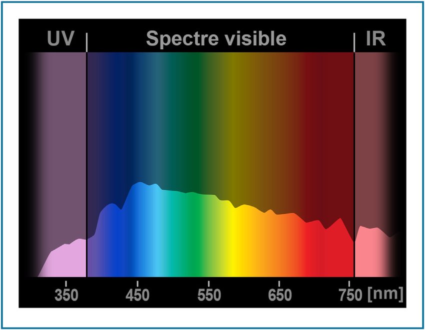
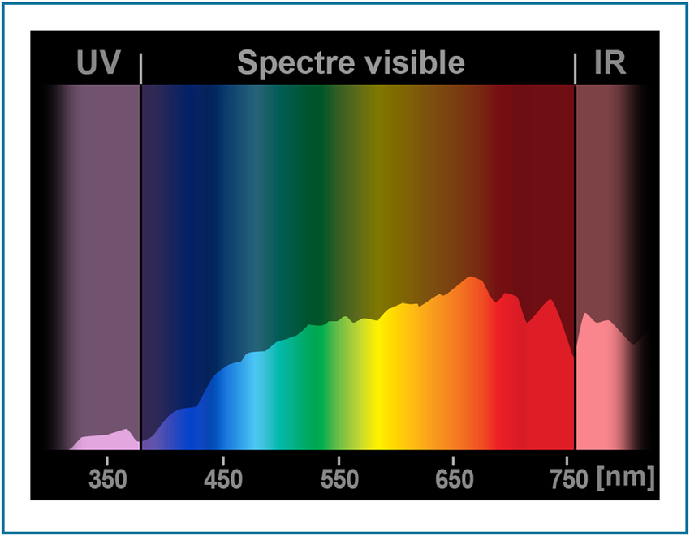
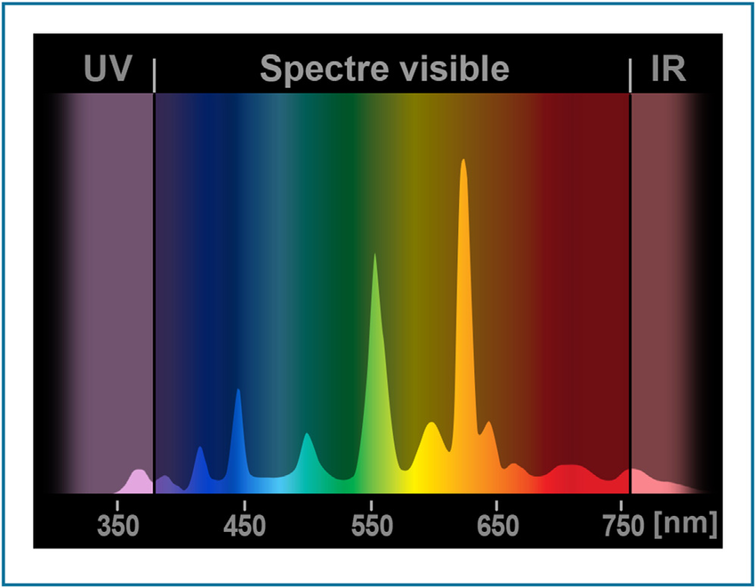

La photo brute (RAW), c'est un enregistrement direct et sans traitement de ce que le capteur de l'appareil photo a « vu ». Il y a beaucoup trop de croyances qui circulent sur les propriétés supposées de cette « image latente », je vous propose de casser du mythe à la pioche.

## 1\. J'ai configuré mon boîtier en Adobe RGB, donc j'utilise un profil d'entrée Adobe RGB.

La configuration de l'espace de couleur, sur le boîtier de l'appareil photo, n'impacte **que** les JPEG produits par le boîtier. En général, vous avez deux options : sRGB et Adobe RGB.

Oui mais alors, dans quel espace de couleur sont enregistrés les raws ?

Dans l'espace du capteur. Un espace RGB bien à lui, qui dépend de la transmittance  des filtres colorés à la surface de la [matrice de Bayer](https://www.google.com/url?sa=t&rct=j&q=&esrc=s&source=web&cd=4&cad=rja&uact=8&ved=2ahUKEwim1vbDvqvgAhXhzVkKHa9DBxkQFjADegQIDBAB&url=https%3A%2F%2Ffr.wikipedia.org%2Fwiki%2FMatrice_de_Bayer&usg=AOvVaw2FZIqJFJ2hJlvVg4-C9Oji) et de l'électronique qui traite les données ensuite. C'est la raison pour laquelle darktable embarque une « matrice » différente pour chaque capteur. La matrice, c'est juste le profil de couleur le plus simple qui existe : un tableau de coefficients 3 × 3. Configurez le boîtier en sRGB, Adobe RGB ou ce que vous voulez,  ça n'impacte pas le raw.

## 2\. Faire la balance des blancs sur l'appareil permet d'avoir de meilleures couleurs dans le raw

La balance des blancs, c'est une compensation des couleurs qui suppose une lumière blanche, et qui se base sur de la physique un peu velue pour faire une correction spectrale qui va simuler un changement de température.

On rentre dans la physique ? La lumière est un rayonnement, et donc une forme de transfert d'énergie (électro-magnétique). À la source de ce rayonnement se trouve un corps, qui émet du rayonnement parce qu'il est chaud (sans chaleur, il n'aurait aucune énergie à transmettre, donc pas de rayonnement). Les physiciens ont trouvé un lien entre la température du corps et le spectre lumineux qu'il émet (en clair : l'ensemble des couleurs contenues dans ce spectre).

\[caption id="" align="aligncenter" width="1280"\] Décomposition du spectre de la lumière blanche par un prisme transparent. CC Wikimédia / Zátonyi Sándor\[/caption\]

Ce lien ne fonctionne que si le corps est « parfait », c'est à dire qu'il émet rigoureusement toutes les longueurs d'onde (on n'a pas de trou dans le spectre). On appelle ça un [corps noir](https://fr.wikipedia.org/wiki/Corps_noir) (paradoxalement, mais il y a une explication). Pour un corps noir, on est capable de sortir une équation qui relie assez précisément sa température et son spectre, et donc de simuler son spectre à une autre température, et donc finalement de corriger une photo. C'est pour ça qu'on exprime la température couleur en kelvin (K) : tout ça se ramène à la température du corps noir dont le rayonnemment est équivalent.

Le soleil est assez proche d'un corps noir, puisqu'il émet toutes les longueurs d'onde :

\[caption id="attachment\_6403" align="aligncenter" width="850"\] Spectre de la lumière naturelle en mi-journée (6500 K). © Erik Peper - https://www.researchgate.net/publication/305082857\_Are\_LED\_screens\_causing\_harm\_to\_the\_vision\_of\_computer\_users\[/caption\]

Même si le spectre est complet, on voit que les intensités sont réparties inégalement, mais globablement assez lisses. Qu'en est-il en fin de journée ?

\[caption id="attachment\_6404" align="aligncenter" width="850"\] Spectre de la lumière naturelle en fin de journée (4500 K). © Erik Peper - https://www.researchgate.net/publication/305082857\_Are\_LED\_screens\_causing\_harm\_to\_the\_vision\_of\_computer\_users\[/caption\]

On voit donc un maximum dans le rouge en fin de journée (à 4500 K), et un maximum dans le bleu en milieu de journée (6500 K). Comme ces deux distributions suivent (à peu près) la même loi physique, il est possible de passer de l'une à l'autre par une simple correction mathématique.

Là où ça se gâte, c'est pour les éclairages artificiels :

\[caption id="attachment\_6405" align="aligncenter" width="850"\] Spectre d'une lampe fluo-compacte. © Erik Peper - https://www.researchgate.net/publication/305082857\_Are\_LED\_screens\_causing\_harm\_to\_the\_vision\_of\_computer\_users\[/caption\]

Ici, on a un pic dans le bleu, dans le vert, et dans le orange, et presque rien au milieu. Un tel éclairage est impossible à compenser mathématiquement, parce que sa physique est erratique et qu'il n'est pas assimilable à un corps noir. Pour cette raison, on dispose d'un curseur de teinte, en plus de la température, afin d'appliquer une correction additionnelle, mais n'attendez pas de miracle. C'est ici qu'il est important de savoir sur quelle hypothèse se basent les algorithmes de correction de la balance des blancs : ils sont conçus avant tout pour la lumière blanche. Si l'hypothèse n'est pas valide dans votre photo, alors l'algorithme échoue, et c'est tout à fait normal.

Du coup, la balance des blancs : dans le boîtier ou dans le logiciel ?

Souvenons-nous que le raw est… brut. Non corrigé. Directement du capteur au fichier. La balance des blancs n'est donc qu'une simple méta-donnée enregistrée dans le fichier brut. Encore une fois, l'appareil va corriger son JPEG, mais c'est tout. Si la balance des blancs est « juste » sur le boîtier, ça veut dire que la correction effectuée par darktable (qui extrait cette méta-donnée et l'utilise comme réglage par défaut) va avoir le bon paramètre dès le départ. Rien de plus. La balance des blancs du boîtier n'impacte pas les couleurs du fichier raw. Sinon, encore une fois, ça ne serait plus un fichier brut…

### 3\. Mon profil d'entrée maison est meilleur que celui par défaut (pris à Adobe)

Si, comme moi, vous êtes un geek, vous vous êtes acheté une mire d'étalonnage type IT8 ou Color Checker, et vous avez fait votre propre profil de couleur, pour être sûr que votre appareil soit parfaitement réglé (soit un profil ICC, soit une table de correspondance).

Erreur… Après des années d'expérience, il m'a fallu me rendre à l'évidence :

1. faire une photo d'une mire éclairée de façon parfaitement homogène par une lumière blanche à 6500 K (standard D65) est impossible hors d'un laboratoire de métrologie,
2. donc votre photo de référence de la mire est toujours plus ou moins fausse,
3. donc votre profil est toujours plus ou moins faux,
4. un profil de type LUT faux est beaucoup plus dommageable pour les couleurs qu'une matrice d'entrée imprécise et basique (saturation non-homogène, couleurs hors-gamut, etc.)

La photo de la mire sous une lumière standardisée à D65 (ou D50) est nécessaire pour que le profil soit « universel ». Sinon, vous risquez d'avoir un spectre biscornu (cf. ci-dessus, le spectre de la fluo-compacte) qui va favoriser certaines couleurs et pas d'autres.

Un profil réalisé dans des conditions non-standard peut être utile pour corriger des conditions de prise de vue difficiles, surtout quand vous utilisez plusieurs appareils et que vous voulez des couleurs homogènes d'une photo à l'autre sans y passer la nuit. Par exemple : retirer une dominante colorée en lumière artificielle. Mais un tel profil ne pourra être appliqué qu'aux photos prises dans des conditions d'éclairage strictement identiques. Et assurez-vous de l'appliquer seulement sur les couleurs (pas sur la luminance), sinon gare aux pertes de contraste local.

Dans darktable, il existe des matrices standards (qui sont des matrices Adobe) et des matrices « améliorées », qui ont été fournies par des contributeurs individuels. À chaque fois que vous utilisez ces matrices, vous faites aveuglément confiance à quelqu'un d'autre, qui a problablement travaillé n'importe comment (en tout cas, on ne peut pas vérifier). Méfiance…

## 4\. L'histogramme du boîtier n'est pas le même que celui de mon logiciel

L'histogramme affiché sur le boîtier est celui du JPEG produit par le boîtier, et intégré en miniature dans le raw. Ce JPEG a reçu une [correction gamma](https://fr.wikipedia.org/wiki/Correction_gamma) et ne ressemble plus au fichier brut. Idem avec l'alerte surexposition du boîtier : c'est la surexposition du JPEG. Pour avoir une idée de l'apparence du raw, il faut diminuer la luminosité dans les préréglages de l'appareil, de façon à inverser la correction gamma. Mais la netteté des photos risque alors de devenir difficile à évaluer à l'écran. Tout se paie…

## 5\. Je peux retoucher le raw comme je veux

On peut globalement découper la retouche d'un raw en deux grandes étapes :

1. la retouche corrective
2. la retouche créative.

La retouche corrective vise à nettoyer l'image des défauts laissés par le système d'imagerie (capteur, optique, etc.) c'est à dire les aberrations chromatiques, distorsions, pertes de netteté, bruit, etc. La retouche créative, c'est quand vous vous faites plaisir.

Le problème, c'est que l'ordre des opérations est important, d'un point de vue mathématique, et que les mêmes opérations dans un autre ordre peuvent avoir un effet complètement différent sur les couleurs. Beaucoup de logiciels dissimulent l'ordre des opérations et l'ont fixé pour vous. Dans darktable, on est en train de prendre la direction opposée. Pour plus de détails, voyez [_Y-a-t'il un ordre canonique dans la retouche ?_](https://darktable.fr/2019/01/y-a-t-til-un-ordre-canonique-dans-la-retouche-photo/).
