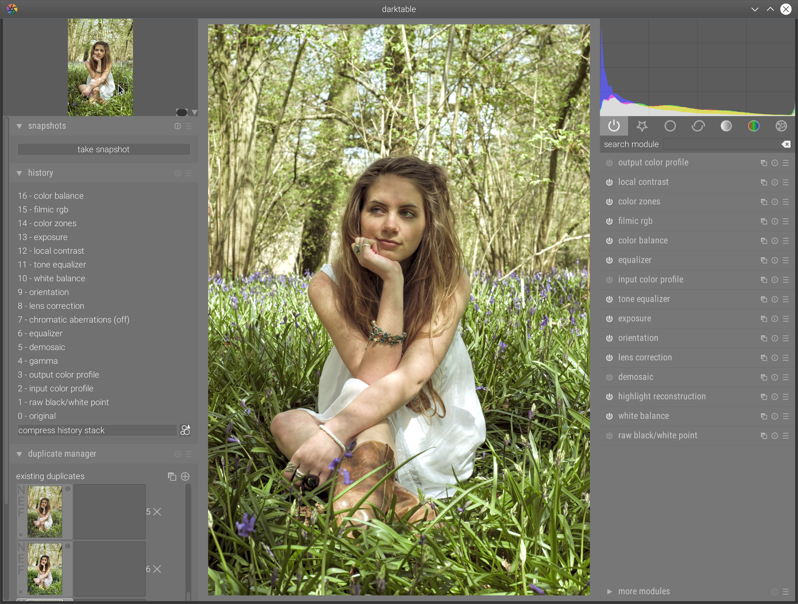

Poursuivant mon travail sur la gestion des hautes (et moins hautes) plages dynamiques qui rendaient la couleur particulièrement difficile à gérer sous darktable dans les situations de fort contraste, mon module égaliseur de tons a été fusionné dans la version de développement de daktable dimanche, et filmique v3 aujourd'hui.

Filmique v3 opère dans un espace RGB choisi par l'utilisateur, en lieu et place du Prophoto RGB linéarisé imposé dans la v2. Il corrige la sursaturation qui se produisait dans la variante avec préservation de la chrominance, et ajoute 2 autres modes de préservation de la chrominance. La courbe filmique utilise désormais une seule méthode d'interpolation, que j'ai développée spécialement à partir de polynômes d'ordre 3 et 4 où j'impose des conditions de raccordement sur les dérivées premières et secondes, afin d'obtenir le comportement souhaité (proche des courbes densitométriques du film) et une meilleure stabilité dans les paramètres. De façon générale, l'ergonomie a été revue pour fournir un module plus rapide à régler et plus clair pour l'utilisateur.

Filmique est toujours, rappelons-le, dédié au mappage global des tonalités, c'est à dire une opération qui consiste à ajuster la plage dynamique de l'appareil photo (habituellement, entre 8 et 14 EV) à la plage dynamique permise par le medium de sortie : écran (7 à 8 EV) ou impression papier (4 à 6 EV). La stratégie utilisée est, à l'image de ce que fait le film, de relever les tons moyens (la « luminosité » générale) de façon logarithmique, puis à compresser graduellement les très hautes et très basses lumières vers le blanc et le noir pur.

Ce module se substitue donc aux modules de mappage global des tonalités, mais aussi à la courbe de base.

Cependant, il manquait encore une façon plus précise et plus localisée d'agir sur le contraste zone par zone, de façon plus organique, avec les mêmes contraintes que filmique : rester dans un espace de couleur relatif à la scène, physiquement réaliste, et préserver la chrominance en conservant les ratios RGB.

Les tireurs qui opéraient en chambre noire avaient inventé une technique, le dodging & burning, qui consistait à sur- ou sous-exposer certaines zones de l'image sélectivement en utilisant des masques découpés dans du carton, de façon à assombrir les zones très claires et éclaircir les zones très sombres (ou l'inverse) pour récupérer des détails. J'ai réutilisé le même principe dans l'égaliseur de ton, qui n'est donc qu'une simple correction d'exposition ajustable zone par zone. L'égaliseur se substitue donc aux modules courbes des tonalités, lumière d'arrière-plan, zones et ombres/hautes lumières.



Mais l'égaliseur de ton va plus loin, en introduisant une nouvelle interaction, directement depuis l'image et sans passer par les curseurs. Je vous laisse découvrir tout ça dans la vidéo tutoriel que j'ai réalisée aujourd'hui, qui détaille l'utilisation jointe de ces 2 modules, en combinaison avec la balance couleur. Elle est, par contre, en anglais puisque destinée en priorité aux béta-testeurs à ce stade :



Souvenez-vous, il y a exactement 13 mois, [je publiais ici un article expliquant comment gérer le HDR](https://darktable.fr/2018/08/recuperer-la-plage-dynamique-sous-darktable/) sous darktable 2.4, avec un style fourni fastidieux et des manipulations laborieuses à base de courbes et de plusieurs modules visant essentiellement à corriger les erreurs du précédent avec le suivant. Il suffit aujourd'hui des modules exposition, filmique et égaliseur de tons pour gérer le contraste, balance des blancs, balance couleur et zones de couleurs pour gérer les couleurs, puis finalement contraste local et égaliseur pour gérer la netteté. Et c'est tout.

Et voici les résultats :


