**Annonce, darktable-release 3.4**  _(Traduction faite avec DeepL et corrigée par Aurélien, JMM40, jpg54, Jipivy, olliwa, vithom et 2 auteurs anonymes)_

Joyeuses fêtes à toutes et tous - c'est l'heure de votre cadeau de Noël préféré. C'est la deuxième grande version de 2020 du projet darktable après la sortie anticipée de darktable 3.2 en août. Année très riche ! Entre les dépôts darktable, rawspeed et dtdocs, il y a eu plus de 5500 commits en 2020 !

## Documentation

Le post-traitement photographique est une entreprise assez difficile et essayer de le gérer sans documentation peut rendre les choses encore plus difficiles ! Cette fois, cependant, l'équipe de darktable a préparé le manuel d'utilisation à temps pour la sortie de la nouvelle version et il est disponible dès aujourd'hui sur [https://www.darktable.org/resources/](https://www.darktable.org/resources/), et entièrement mis à jour.

## Nouvelle documentation sur Markdown !

Mais vous savez comment c'est... Vous attendez depuis des lustres un manuel d'utilisation à jour et puis deux arrivent en même temps sous le sapin de Noël ! La version actuelle du manuel d'utilisation nous a bien servi pendant les 10 dernières années, mais elle est maintenant arrivée en fin de vie. Elle utilisait une pile logicielle XML compliquée qui devait être compilée en HTML ou PDF. Cette complexité décourage de nombreux contributeurs tout en étant difficile à construire localement.

Ainsi, pour la version 3.4 de darktable, nous publions également la première version du nouveau manuel d'utilisation, désormais divisé en un projet séparé appelé "dtdocs". Nous avons complètement réorganisé et réécrit le manuel dans une structure plus facile à maintenir en utilisant Markdown. Ce projet a impliqué une refonte importante du texte, le rendant beaucoup plus facile à lire pour les anglophones.

Pour l'instant, ce projet n'est pas prêt à prendre entièrement le relais de la documentation existante, il coexistera donc (en anglais uniquement) avec l'ancienne version, qui est conservée pour les liens d'aide et les traductions dans l'application. Le projet dtdocs prendra complètement le relais avec des traductions dans le cadre du darktable 3.6.

La version darktable 3.4 des dtdocs est disponible sur [https://www.darktable.org/usermanual/en/](https://www.darktable.org/usermanual/en/) et est maintenue sur [https://github.com/darktable-org/dtdocs/](https://github.com/darktable-org/dtdocs/).

Un projet similaire est également en cours pour transférer la documentation de lua vers Markdown. Ce projet devrait être prêt dans les mois à venir et est actuellement maintenu à [https://github.com/darktable-org/luadocs/](https://github.com/darktable-org/luadocs/).

## Amélioration des performances

Qui aime attendre devant son écran ?

De nombreux algorithmes de traitement d'images gourmands en calcul ont été mis à jour pour être plus rapides et plus évolutifs lorsqu'ils fonctionnent sur le CPU. Les opérations améliorées comprennent

- la _réduction de bruit moyennes non-locales_ (utilisée à la fois par "_réduction du bruit (moy. non locales)_" et "_réduction bruit (profil)_" lorsqu'il est réglé sur le mode des moyennes non locales),
- le _filtre bilatéral_ (utilisé par le "_contraste local_", le mappage des couleurs, le mappage global des tonalités, le passe-bas, le monochrome, la retouche, et les ombres et les hautes lumières),
- et le _filtre guidé_ (utilisé par "_suppression de la brume_"et l'adoucissement guidé du masque dessiné).

Beaucoup de re-calculs inutiles ont été éliminés, ce qui a permis d'obtenir une interface utilisateur plus réactive lors de l'édition d'une image dans la chambre noire. L'affichage des masques paramétriques et par canal montre une amélioration particulièrement marquée.

En outre, la version 4 de "_filmique RVB_" fonctionne désormais avec OpenCL et la _reconstruction des hautes lumières_ est désormais beaucoup plus rapide avec du matériel compatible OpenCL.

## Nouveau module : calibration des couleurs

La révolution de la science des couleurs continue dans darktable !

Le nouveau module de "_calibration des couleurs_" absorbe le module de "_mixage des canaux_" .

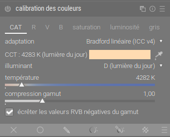 Il existe un certain nombre de problèmes dans le module "_mixeur des canaux_" actuel qui ne peuvent être résolus sans avoir un impact destructif sur les anciennes retouches.

En même temps que la résolution de tous ces problèmes, le nouveau module offre également une meilleure _balance des blancs_, ou _adaptation chromatique_.

L'équilibrage des blancs n'est qu'une partie de l'adaptation chromatique, qui vise plus globalement à simuler la façon dont la scène actuelle apparaîtrait si elle avait été éclairée par un autre _illuminant_ (en l'occurence, par l'illuminant de l'écran). Alors que la _balance des blancs_ se préoccupe uniquement de s'assurer que les hautes lumières finissent par être neutres, l'_adaptation chromatique_ concerne toute la gamme des couleurs. Le nouveau module utilise un _mixeur des canaux_ avec des paramètres pré-calculés, ce qui produit généralement des couleurs plus vives et plus agréables, notamment pour les tons de peau.

Comme l'_adaptation chromatique_ est en fait un _mixeur des canaux_ déguisé, il a été décidé de transformer le nouveau _mixeur des canaux_ en un centre névralgique complet pour les corrections de couleurs. Ce module permet aux utilisateurs :

- d'ajuster avec précision les _profils d'entrée_ des appareils photos (un autre _mixeur des canaux_ déguisé),
- de réaliser une adaptation robuste des _illuminants_ avec la _transformée de Bradford_ (utilisée par ICC v4) et la _CAT16_ (du modèle de prédiction des couleurs CIE CAM 2016),
- d'appliquer une gradation créative des couleurs.

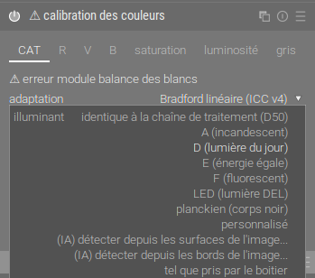

Il permet également aux utilisateurs

- de nettoyer le gamut d'entrée du pipeline avec une compression non destructive du gamut,
- et (en dernier recours) un écrêtage destructif du gamut, pour aider à traiter les tristement célèbres lumières LED bleues.

La compression du gamut vise à maintenir la _luminance_ inchangée et la _teinte_ aussi proche que possible de l'original, tout en réduisant la _saturation_ jusqu'à ce que l'image entière s'inscrive dans le gamut de l'espace colorimétrique de travail.

Ce nouveau module peut être utilisé en conjonction avec des masques, ce qui permet une correction sélective de l'_illuminant_ pour les cas où plusieurs sources de lumière colorée sont présentes en même temps sur la scène, et où aucune adaptation globale ne peut les corriger toutes à la fois. Il fournit une bibliothèque complète d'illuminants standards de la Commission Internationale de l'Éclairage (CIE) ainsi que 2 algorithmes d'apprentissage machine pour trouver l'_illuminant_ le plus probable pour la scène lorsqu'aucune couleur neutre ne peut être trouvée dans l'image. Il peut également utiliser la _balance des blancs_ définie par l'appareil à la prise de vue, écrite dans les métadonnées EXIF du fichier brut, et l'utilisera comme paramètre par défaut.

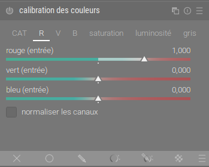

Quelques préréglages de film N&B sont fournis dans le module pour émuler les conversions de couleur en monochrome. Contrairement aux anciens préréglages de l'ancien _mixeur des canaux_, qui n'avaient aucune base physique réelle, ceux-ci sont calculés à partir de la sensibilité spectrale des émulsions de film et correctement équilibrés dans le domaine spectral pour un _illuminant D50_, de sorte qu'ils soient plus proches de la réponse réelle du film (mis à part les réactions argentiques locales).

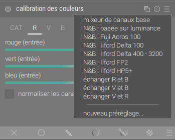

Un nouveau flux de traitement "moderne", désactivé par défaut, permet d'utiliser la "_calibration des couleurs_" pour effectuer la _balance des blancs_ à la place du module de "_balance des blancs_" pour les nouvelles retouches. Vous pouvez l'activer manuellement dans les _préférences_ (onglet _traitement_).

En dehors de cela, le module "_calibration des couleurs_ vous permettra d'assombrir ou d'éclaircir l'image en préservant les couleurs, en utilisant les valeurs des pixels, dans le même esprit que _filmique_, par exemple pour assombrir rapidement le ciel. Enfin, il peut affecter la saturation en fonction du canal, là encore en utilisant la science des couleurs de "_Filmique RVB v4_" (qui n'est pas linéaire pour la teinte).

La documentation complète du nouveau module est disponible ici : [https://www.darktable.org/usermanual/en/module-reference/processing-modules/color-calibration/](https://www.darktable.org/usermanual/en/module-reference/processing-modules/color-calibration/)

Voir aussi la notification d'annonce sur  [discuss.pixls.us](https://discuss.pixls.us/t/introducing-color-calibration-module-formerly-known-as-channel-mixer-rgb/21227 .)

## Filmique RVB

Trois nouveaux modes de visualisation ont été ajoutés au module filmique RVB pour aider l'utilisateur à comprendre sa fonctionnalité.

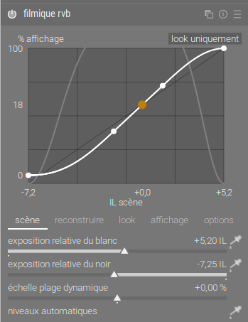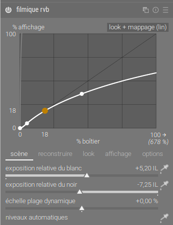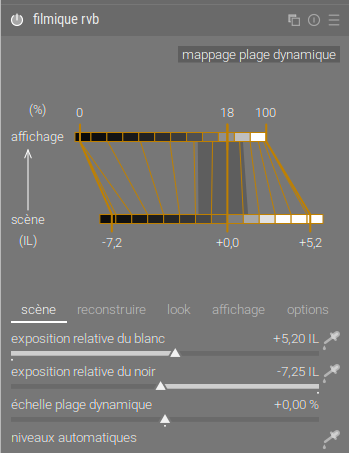

Il convient de noter tout particulièrement la vue de "_mappage de la plage dynamique_". Cette vue est inspirée du système de zones d'**Ansel Adams**, montrant en une dimension comment les zones EV de la scène d'entrée sont mappées à la sortie. Le gris moyen de la scène est, par défaut, mappé à 18% dans l'espace (linéaire) de sortie, et il montre comment les plages tonales vers les extrêmes de la plage d'exposition de la scène sont comprimées en un nombre plus restreint de zones dans l'espace d'affichage, laissant plus de place pour que les tons moyens soient répartis sur les zones restantes. Cette vue a été conçue pour remplacer la vue habituelle de la courbe de tonalité, qui cache sous un graphique en 2 dimensions le fait très important que ce qui est ton est un mélange d'intensité en une dimension de la plage d'entrée à la plage de sortie.

Pour plus d'information, veuillez consulter le manuel de l'utilisateur : [https://www.darktable.org/usermanual/en/module-reference/processing-modules/filmic-rgb/](https://www.darktable.org/usermanual/en/module-reference/processing-modules/filmic-rgb/)

## Améliorations de l'égalisateur de ton

L'un des principaux problèmes de la version actuelle du module "_égaliseur de ton_" est que l'algorithme de filtrage guidé tend à lisser les hautes lumières beaucoup moins qu'il ne lisse les ombres, et à être plus sensible aux bords verticaux/horizontaux qu'aux bords diagonaux. La dernière version de darktable introduit un nouveau filtre guidé par défaut indépendant de l'exposition (eigf - _exposure-independent guided filter_) spécialement développé par l'équipe de darktable, qui résout certains de ces problèmes tout en améliorant considérablement les performances du module. Les algorithmes de lissage des surfaces disponibles pour le contrôle des "préservation détails" sont désormais les suivants :

- non
- filtre guidé
- filtre guidé moyen
- eigf (par défaut)
- eigf moyen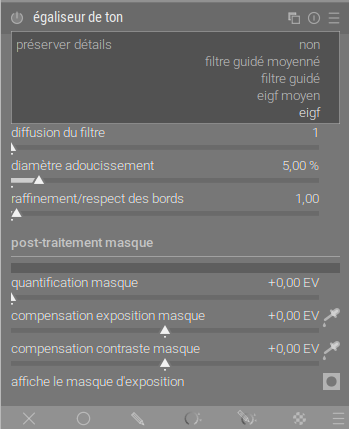

Vous trouverez une description détaillée des algorithmes de lissage dans la documentation : [https://www.darktable.org/usermanual/en/module-reference/processing-modules/tone-equalizer/](https://www.darktable.org/usermanual/en/module-reference/processing-modules/tone-equalizer/)

## Fusion et masquage linéaire relatif à la scène

Actuellement, la plupart des modes de fusion écrêtent les valeurs des pixels à 100 %, ce qui les rend inadaptés au flux de travail relatif à la scène. Rappelons qu'un pipeline relatif à l'affichage force les valeurs des pixels entre 0 et 100 %, par rapport à la luminance du blanc du medium d'affichage. C'est une limitation pour l'imagerie HDR car elle doit être forcée de façon non linéaire dans cette plage au début du pipeline, ce qui fait perdre la cohérence des couleurs en cours de route. Le pipeline relatif à la scène maintient les intensités de pixels sans écrêtage aussi longtemps que possible et reporte le mappage non-linéaire de la plage à la dernière étape du pipeline, ce qui permet une composition alpha correcte ainsi que des simulations de filtres optiques à l'intérieur du pipeline, quelle que soit la plage dynamique de la scène.

De plus, le masquage paramétrique RVB utilise un modèle de couleur HSL, dans lequel les pixels supérieurs à 100 % produisent une saturation négative. Ainsi, même avec des modes de fusion  sans écrêtage, cela ne fonctionne toujours pas en mode relatif à la scène.

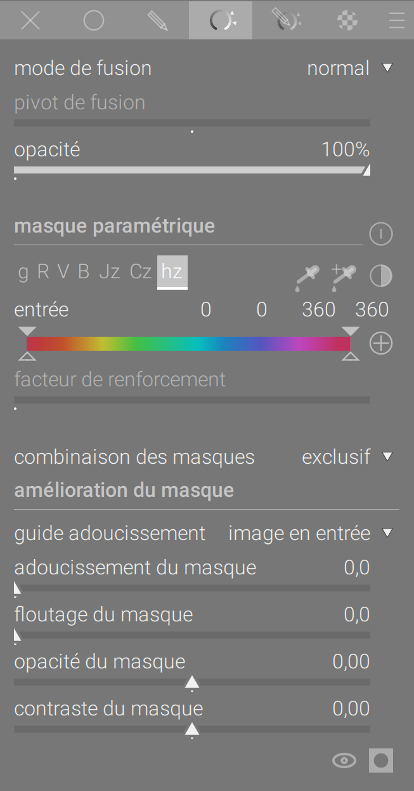

 

C'est pourquoi un nouveau mode de fusion et de masquage a été introduit. Il n'utilise que des opérateurs de fusion sans écrêtage et introduit un facteur de renforcement qui permet de masquer les pixels jusqu'à 18 EV au-dessus du blanc de l'affichage (fixé à 100 % par convention, soit 0 EV). Pour un masquage robuste et cohérent, il introduit _JzCzhz_, un espace colorimétrique perceptuel découplant _luma/chroma/teinte_ avec la même logique que Lch (issu de CIE Lab 1976), mais conçu pour le HDR et montrant une linéarité de teinte presque parfaite, calculée à partir de l'espace _JzAzBz_ publié en 2017.

Si _JzCzhz_ est un espace non linéaire, il n'est utilisé que pour produire un masque d'opacité/transparence à partir de l'image, et la fusion réelle est effectuée dans l'espace colorimétrique natif du module. En outre, l'espace _JzCzhz_ est calculé en utilisant le profil de couleur du module courant, ce qui signifie que le même masquage paramétrique produira le même masque de teinte avant ou après le profil de couleur d'entrée.

Cela s'accompagne également d'une légère accélération du code de masquage et de fusion.

En plus de ces nouvelles possibilités de fusion, l'interface utilisateur du masque paramétrique a été allégée en masquant les curseurs du masque de sortie par défaut. Ceux-ci peuvent être réactivés à partir du menu du mode de fusion.

Voir le manuel pour plus de détails : [https://www.darktable.org/usermanual/en/darkroom/masking-and-blending/overview/](https://www.darktable.org/usermanual/en/darkroom/masking-and-blending/overview/)

## Groupes de modules

De nombreux utilisateurs ont demandé la personnalisation des groupes de modules, et cette fonctionnalité est maintenant disponible ! Les modules de traitement dans la chambre noire peuvent désormais être affectés à des groupes de modules définis par l'utilisateur. Cela remplace le groupe "_favoris_" précédent et le module "_plus de modules_" par un outil qui vous permet de créer vos propres groupes et préréglages de modules en fonction de votre flux de travail. Un certain nombre de présélections par défaut sont incluses.

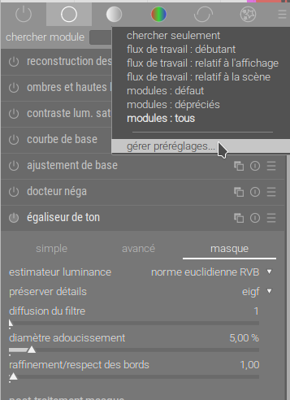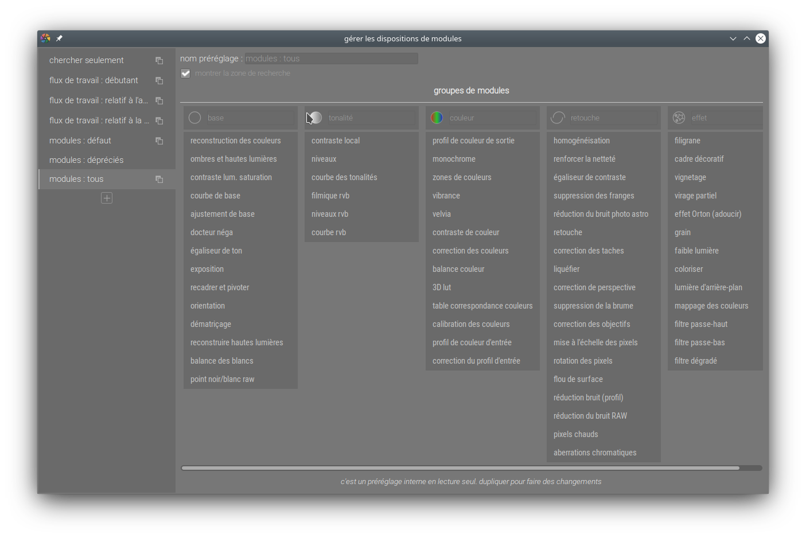

Voir le manuel pour plus de détails : [https://www.darktable.org/usermanual/en/darkroom/interacting-with-modules/search-and-group/](https://www.darktable.org/usermanual/en/darkroom/interacting-with-modules/search-and-group/)

## Alerte d'écrêtage

Actuellement, la prévisualisation de la sur et sous-exposition de la chambre noire met en évidence les pixels où l'un des 3 canaux RVB se trouve en dehors d'une plage définie par des seuils supérieurs et inférieurs. Cette information n'est pas très utile car ce type d'écrêtage peut provenir d'une combinaison d'écrêtage de luminance (véritable surexposition) et d'écrêtage de gamut (sursaturation ou absence de mappage de gamut appropriée). Les utilisateurs prennent cet indicateur très au sérieux et sont souvent trompés par les informations affichées.

darktable 3.4 remplace l'aperçu de la surexposition par une nouvelle "_alerte d'écrêtage_" qui combine les indicateurs de luminance et d'écrêtage du gamut en un seul utilitaire.

 

Veuillez consulter : [https://www.darktable.org/usermanual/en/module-reference/utility-modules/darkroom/clipping/](https://www.darktable.org/usermanual/en/module-reference/utility-modules/darkroom/clipping/) pour une documentation complète sur ce nouveau mode. Notez que l'avertissement de gamut est toujours disponible pour le moment mais est largement remplacé par la nouvelle fonctionnalité.

## Nouveau : script manager

"_script manager_" est un script Lua qui est maintenant accessible dans la table lumineuse. Il permet d'installer tous les scripts Lua disponible dans le dépôt. Les scripts Lua sont des extensions qui permettent par exemple de lier darktable à d'autres applications, d'exporter sur des services en ligne, d'effectuer des opérations avancées sur les métadonnées, ou encore d'utiliser la reconnaissance faciale par intelligence artificielle pour assigner des mots-clés automatiques aux images. Le manager de scripts permet donc d'installer ou de désinstaller facilement les extensions présentes sur le dépôt officiel.

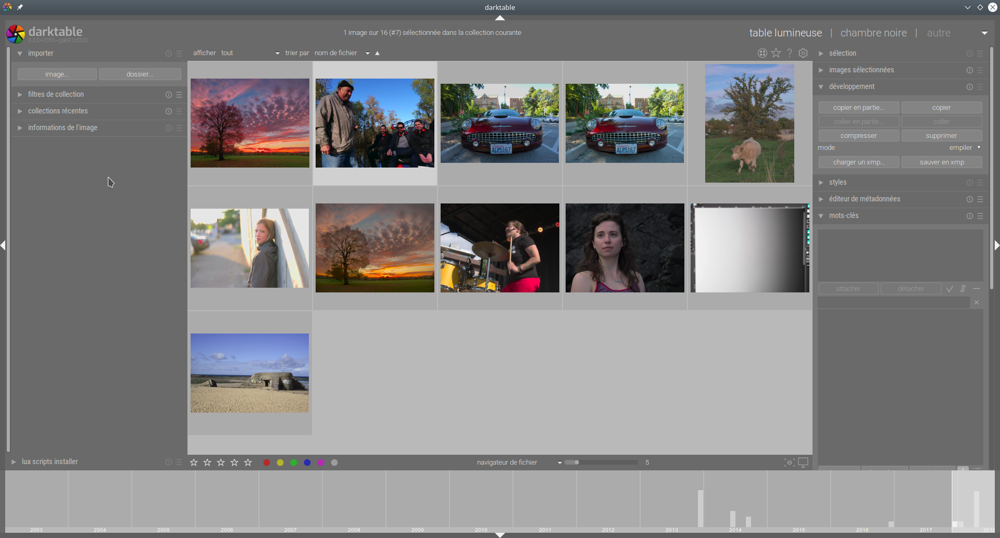

## Exporter des formats d'impression

Le module d'exportation de la table lumineuse permet désormais de calculer la taille de l'image finale exportée en pixels en entrant soit :

- Un facteur d'échelle, à appliquer à la taille de l'image originale (après recadrage), ou
- La hauteur et/ou la largeur de l'image exportée en pouces ou en centimètres, ainsi que le DPI souhaitée.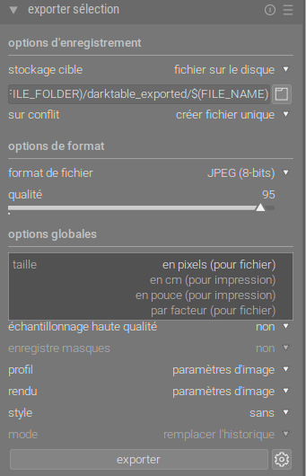

## Carte de géolocalisation

Une bonne nouvelle pour les amateurs de géolocalisation ! Les images qui sont proches les unes des autres sont désormais regroupées et un décompte des images regroupées est affiché. Cela améliore les performances dans les situations où de nombreuses images d'une collection ont des données de localisation stockées. Le défilement de la souris sur le groupe d'images permet de faire défiler les images groupées. Les groupes contenant des images sélectionnées sont mis en évidence par une bordure blanche. Le nombre d'images est affiché en blanc si toutes les images du groupe se trouvent exactement au même endroit, et en jaune dans le cas contraire.

Un nouveau module de localisation a été ajouté, permettant de créer des zones ou des lieux et de les organiser à l'aide de balises hiérarchiques.

Voir :  [https://www.darktable.org/usermanual/en/module-reference/utility-modules/map/locations](https://www.darktable.org/usermanual/en/module-reference/utility-modules/map/locations)

## Préférences

Les améliorations suivantes ont été apportées à la boîte de dialogue des préférences et des paramètres :

- Les préférences modifiées (celles qui ont été changées par rapport à leurs valeurs par défaut) sont maintenant indiquées par un symbole de puce.
- Si les préférences sont modifiées et nécessitent un redémarrage pour prendre effet, un message apparaîtra pour vous rappeler de redémarrer lorsque vous quitterez le dialogue des préférences
- Un certain nombre de préférences ont été modifiées de telle sorte qu'elles ne nécessitent plus un redémarrage pour prendre effet.

- La fonctionnalité "_Ajustements du thème CSS_" de l'onglet Général a maintenant un déroulement des opérations plus intuitif - appuyez sur le bouton "_enregistrer et appliquer_" pour appliquer votre CSS immédiatement sans avoir à cocher la case "modifier le thème avec des ajustements CSS". Cette case peut toujours être utilisée pour désactiver temporairement vos modifications.

## Modules obsolètes

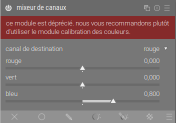

Les modules de traitement suivants sont dépréciés dans darktable 3.4. Ces modules continueront à être disponibles pour les anciennes modifications et peuvent toujours être accessibles pour les nouvelles modifications via le groupe de modules prédéfini "modules : obsolètes". Toutefois, il convient de noter qu'à partir de la version 3.6, ces modules ne seront plus disponibles pour les nouvelles modifications.

- Le module "_mixeur de canaux_" est remplacé par le module "_calibration des couleurs_".
- Le module "_inverser_" est remplacé par le module de "_docteur néga_".
- Les modules "_lumière d'appoint_" et "_zones_" sont désormais remplacés par le module "_égaliseur de ton_"
- Les modules "_mappage global tonalités_" et "_mappage tonalités_" sont remplacés par les modules "_filmique rvb"_ et "_contraste local_"

## Modules renommés

Les modules suivants ont été renommés pour mieux décrire leur utilisation. Ces modules peuvent toujours être trouvés en utilisant leurs anciens noms dans la boîte de recherche des modules.

- "_réduction bruit (moy. non-locales)_" s'appelle maintenant "_réduction du bruit photo astro_"
- "_réduction bruit (bilatéral)_" s'appelle maintenant "_flou de surface_"

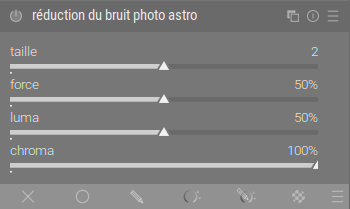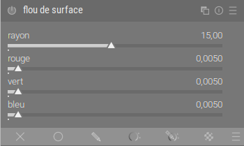

## Améliorations de l'interface utilisateur

De nombreux modules existants ont fait l'objet d'une mise à jour de leur interface utilisateur.

- La présentation des modules de "_retouche_" et de "_balance des blancs_" a été complètement réécrite.
- Il est maintenant possible de choisir différentes dispositions de l'interface utilisateur pour le module de "_balance des couleurs_", afin de réduire sa hauteur.
- Les modules de "_courbe des tonalités_" et de "_courbe de bas_e" ont été alignés pour utiliser une interface commune.
- Un certain nombre de modules utilitaires peuvent maintenant être ajustés en hauteur en passant la souris dessus et en appuyant sur Ctrl+scroll.
- Le module de la pile historique de la chambre noire montre maintenant les changements qui ont été effectués entre les historiques lorsque vous passez la souris sur le module.
- L'interface utilisateur du module global de sélection des couleurs a été révisée.
- Il est désormais possible de masquer automatiquement les boutons d'en-tête des modules de traitement dans la chambre noire.
- Si vous passez votre souris sur l'en-tête d'un module de traitement, une info-bulle s'affiche et vous permet d'obtenir une documentation détaillée dans l'application.

## Autres changements

- « _Capture_ » a été retravaillée pour améliorer la stabilité et inclut à nouveau le module d'histogramme.
- Un nouveau bouton a été ajouté pour activer le mode "_détection de focus_", en complément du raccourci clavier existant.
- En cliquant sur le bouton de réinitialisation du module de la pile de l'historique de la chambre noire, vous pouvez en un seul clic supprimer l'historique de votre image actuelle.
- La pile de l'historique peut maintenant être tronquée - c'est-à-dire supprimer tous les éléments de l'historique au-dessus de celui sélectionné mais sans les compresser - dans la chambre noire en maintenant la touche _Ctrl_ enfoncée tout en cliquant sur le bouton "_compresser la pile de l'historique_".
- De nouvelles fonctionnalités ont été ajoutées à _darktable-cli_.
- Les catégories de filtres de la boite de dialogue dans les images de collection sont maintenant organisées en groupes.
- Les bases de données sont désormais régulièrement vérifiées pour détecter toute corruption.
- Les sauvegardes des bases de données sont désormais effectuées automatiquement, ce qui vous permet de revenir facilement à un état antérieur en cas de corruption.
- Par défaut, les boutons copier et coller excluent désormais certains modules qui peuvent causer des problèmes lorsqu'ils sont collés entre les images. Vous pouvez toujours inclure ces modules en utilisant les boutons "_copier des parties_" et "_coller des parties_".
- Les préréglages automatiques des modules peuvent être réappliqués en maintenant la touche _Ctrl_ enfoncée tout en cliquant sur le bouton de réinitialisation du module.
- L'importation des images d'un appareil photo sous Windows devrait être plus stable, car l'API gPhoto n'est plus utilisée.
- Les panneaux latéraux peuvent être plus étroits et présenter moins de problèmes graphiques, ce qui vous permet de réserver plus de place à l'écran pour vos images.
- Le support des TIFF 16 bits a été ajouté.
- Le support des niveaux de gris a été ajouté pour le format AVIF.
- Un nouveau préréglage a été ajouté au module "_réduction du bruit (profil)_" pour supprimer uniquement le bruit de chrominance en utilisant le mode ondelettes.
